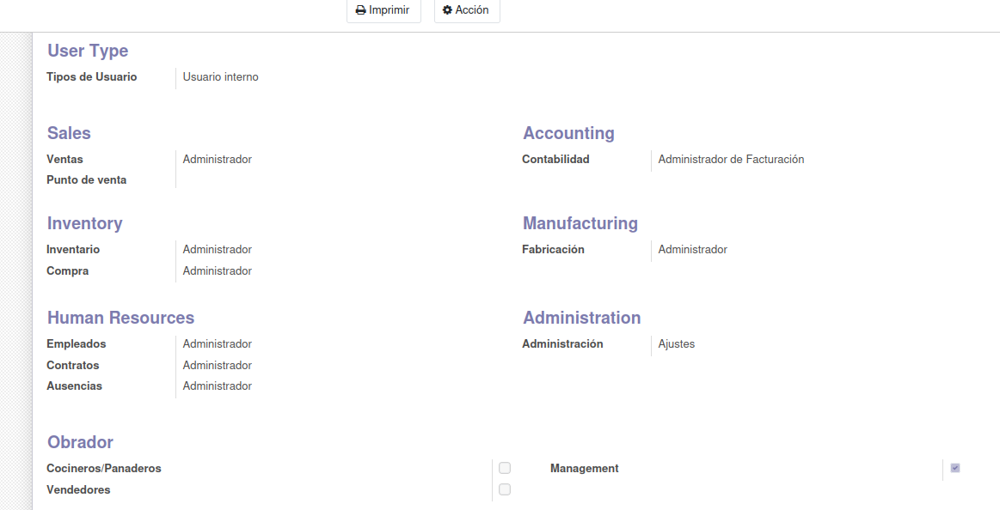

## **Configuración**
Una vez instalado el módulo, realiza los siguientes ajustes en Odoo:

**Paso 1:** 

Accede a Ajustes > Usuarios

**Paso 2: Asignamos permisos**
   - Revisamos los permisos bajo la sección de **`Obrador`**
   - Veremos 3 roles como opción: **`Management`**, **`Cocineros/Panaderos`** y **`Vendedores`**. 
   - Cada rol tiene diferentes permisos, mientras que **`Manajement`** tiene permisos sobre todo el módulo.
   - También tenemos que darles permisos a los usuarios para poder crear "Órdenes de producción" en la sección de **`Manufacturing`**.
   - Además, tendrémos que darle permisos para el **`Inventory`**, si no, no podrán acceder a los productos y su inventario.

  

**Paso 3:**

El modulo necesita tener instalado los modulos de **`product`** y **`mrp`**. Verifica que se han instalado junto con nuestro módulo. 

**Paso 4:**

- Veremos que el módulo viene precargado con productos/materia prima, con los cuales, podremos crear recetas.
- Para poder ver en funcionamiento la parte de **`remanentes`**, tendremos que crearnos algunas **`Ordenes de Producción`** por nuestra cuenta.