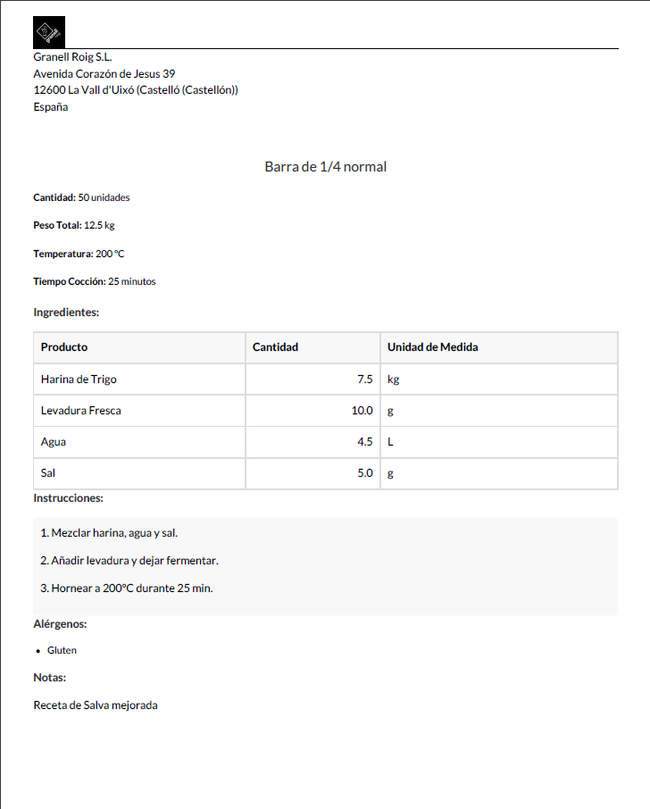
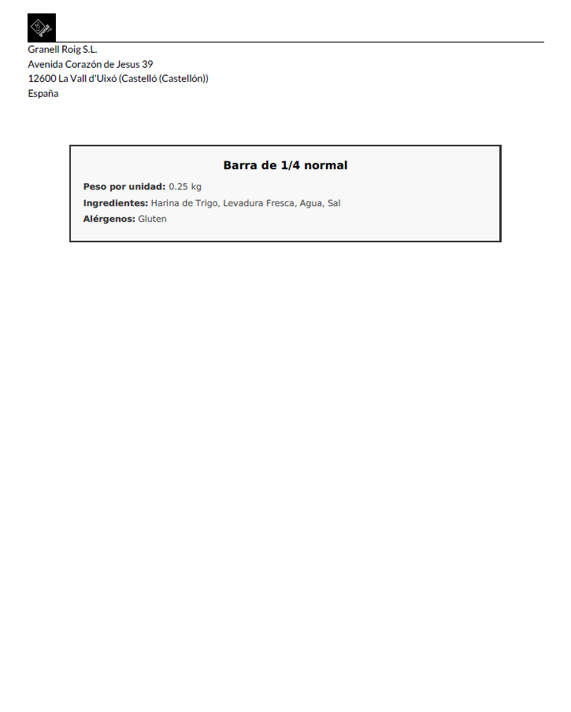
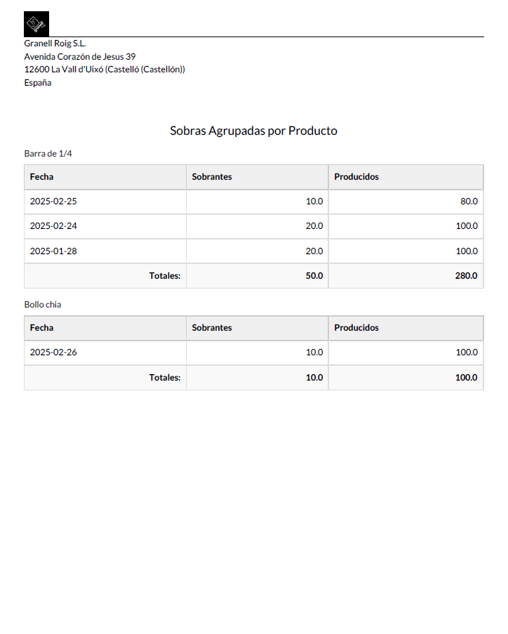

## **INFORMES**

### Informes para las recetas

-	Podemos imprimir la receta con todos sus datos para poder utilizarlo en la producción.
-	Podemos imprimir etiquetas para los productos, donde nos enseña los ingredientes, los alergenos y el peso por producto.

  
  

### Informe para los remanentes

Tenemos como opción seleccionar varios registros de varios días, o meses, para varios productos. Entonces, el módulo nos puede generar un informe donde nos agrupa las sobras, y las producciones, por producto y nos calcula los totales de esos datos.

  

