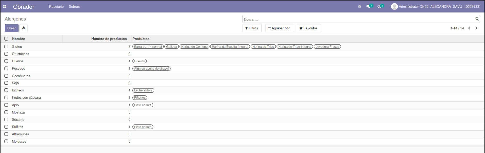
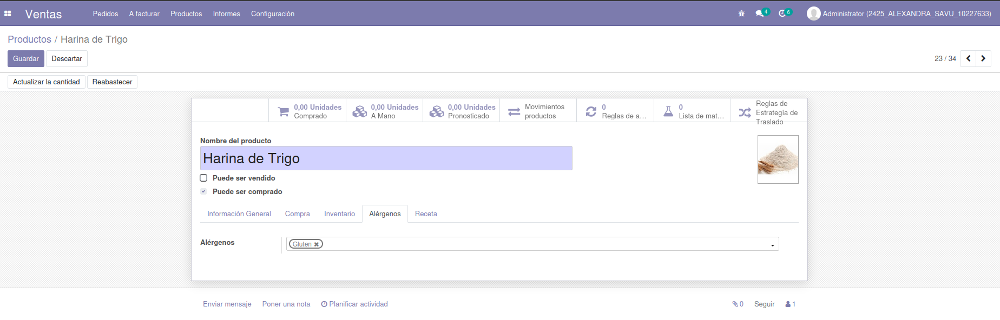
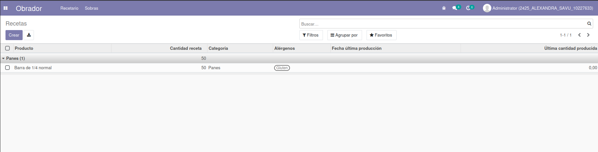
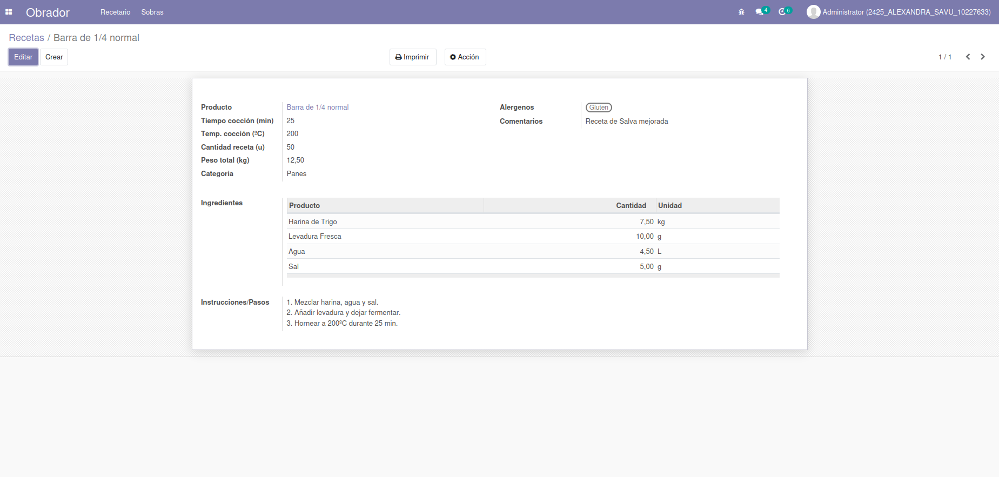
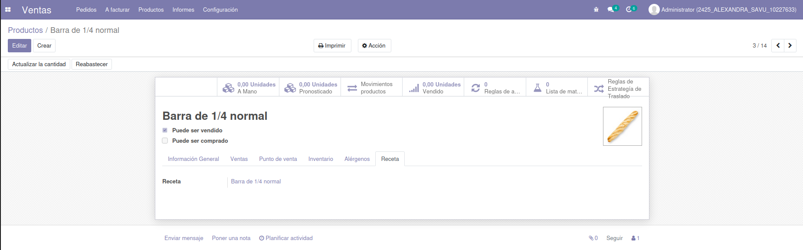

## **RECETARIO**

### Alergenos

El módulo viene ya precargado con los 14 alergenos que Sanidad nos pide. A partir de aquí podremos añadirlos a los productos que tenemos precargados en el módulo **Product** de Odoo.

  

En las siguientes columnas tenemos los siguiente:
-	Número de productos totales, en los cuales aparece dicho alergeno.
-	Nombre de los productos en los cuales aparece.

Las columnas se irán actualizando a medida que añadamos alergenos a los productos y creemos recetas con dichos productos.

  

Aquí vemos, como podemos añadir alergenos a las materias primas, de una lista desplegable. Esto actualizará los campos de los alergenos. 

### Recetas

El recetario permite crear recetas para productos existentes en Ventas o en Compras (ya que los dos utilizan product, modulo del cual nosotros dependemos). Está vista tree, también nos dice cual fue la última cantidad producida de este producto y la cantidad que produce la receta.

  

En el formulario del recetario, podemos añadir ingredientes en una lista que está conectada con los productos antes mencionados. Si esos ingredientes/productos contienen alergenos, el field de los alergenos se actualizará automáticamente, además, la lista de alergenos del product, también se actualizará.

  

Además, la receta nos aparecerá como link en el apartado de **Recetas** en la ficha del producto.

  

