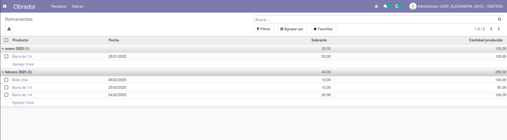
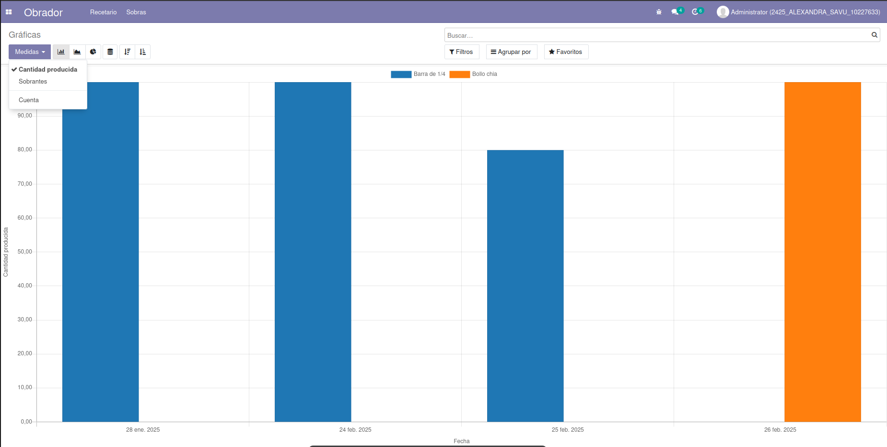
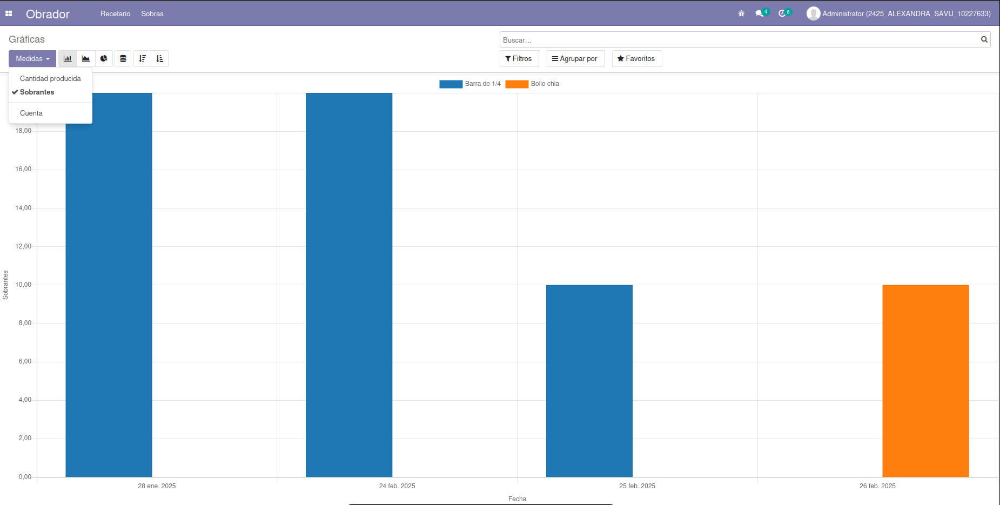

## **SOBRAS**

### Remanentes

-	Aquí podremos añadir sobras de los productos que anteriormente hemos catalogado como “Elaborado” en el apartado de productos. 
-	Tenemos permitido añadir solo una entrada por día para el mismo producto.
-	Podemos escoger el producto, la fecha (el módulo nos rellena el field automáticamente con la fecha actual) y las sobras del día.
-	Si ese producto ha tenido una producción se día (que es lo más normal, si no, no registraríamos sus sobras) nos aparecerá en un campo calculado la cantidad producida.

  

### Gráficas

En el apartado de gráficas, podemos ver a modo de barras, las **sobras** o las **producciones** de los varios productos que tenemos clasificado por día.

  
  

